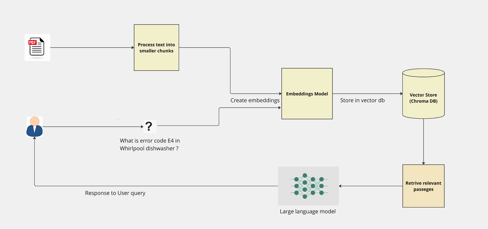

# DishGenie

DishGenie assist you in finding issues related to your dishwasher and quickly fix them. You can ask questions like
"I am having trouble with a Model 18 ADA dishwasher. It’s showing an error code E4 and the customer is complaining is it not draining."
It can also assist you to ask general question like "how to clean dishwasher ?"
It can also assist you in terms of booking the appointment.

## Prerequisite:
I have implemented the task in two approaches :

### API Based:
It uses gpt for creating embedding OpenAIEmbeddings and model gpt-3.5-turbo. In order to run the solution, we need to
provide GPT API key. It can be generated here https://platform.openai.com/api-keys.
Further details will be provided in next section

### OpenSource based.
It uses open source embeddings model all-mpnet-base-v2 https://huggingface.co/sentence-transformers/all-mpnet-base-v2 and microsoft/Phi-3-mini-4k-instruct https://huggingface.co/microsoft/Phi-3-mini-4k-instruct
It does not need any key. I have try to use a smaller model as my current machine does not have the CPU and inference may take some time.

## Architecture

In the workflow, PDF files are getting loaded and preprocessing has been performed on the text.
Further, the text is then divided into smaller chunks and embeddings are getting created and store in vector database.

## Project structure
In designing of the project structure, I have followed the container approach, so It can get extended to production
as a docker image and can be used by machine learning orchestration tools like kubeflow.

1. resources : contains various resources like architectural diagram.
2. source : pdf files that has been shared in the assignments.
3. src : contains the source code of the application and can further be divided:
    a. api_based : contains application logic with gpt approach.
    b. opensource: contains application logic with opensource approach.
    c. scheduler : contains application logic for booking appointments. Please note that
    I have create a dummy appointment scheduler for the task with limited functionalities.
    d. shared: Shared code like GPT key that is used by other components.
    e. requirements.txt : contains all the required libraries that is needed to run the application.

### How to Run

#### API based
1. Create a new python virtual environment and install requirements.txt file places under `src/container/requirements.txt` with command `pip install -r requirements.txt`
2. It will download all the required libraries.
3. Setup GPT key in environment variable `OPENAI_API_KEY`. For simplicity, I have added in python code but in production it should be set as a environment variable.
    `src/container/shared/constants.py` -> `GPT_KEY = "*****"`
    Replace GPT_KEY with the correct key.
4. Run file `src/container/api_based/dishgenie_gpt.py`

I have added questions given in the assignment in list. Feel free to change it to other questions.

`questions = [
    "I ’m having trouble with a Model 18 ADA dishwasher. It’s showing an error code E4 and the customer is "
    "complaining is it not draining.",
    "Yes, I’ve checked it and there doesn’t seem to be any physical obstruction."
    "I have accessed the pump. There’s some debris here. I’ll clean it out and see if that fixes the issue.",
    "It works!"
]`

#### Possible conversation :
DishGenie is ready to provide answers, Please ask ...

Technician I ’m having trouble with a Model 18 ADA dishwasher. It’s showing an error code E4 and the customer is complaining is it not draining.

##### DishGenie:Error code E4 on the dishwasher indicates an overflow issue, not a draining problem. If water flows into the base and activates the overflow switch, the dishwasher will display E4. To address this, you should check the use of detergent. If the dishwasher is not draining, it might be a different issue unrelated to error code E4.

Technician:Yes, I’ve checked it and there doesn’t seem to be any physical obstruction.I have accessed the pump. There’s some debris here. I’ll clean it out and see if that fixes the issue.

##### DishGenie:Cleaning out debris from the pump is a good step to take when addressing drainage issues in a dishwasher. After cleaning the pump, you can test the dishwasher to see if the problem is resolved. If the error code E4 persists after cleaning the pump, further troubleshooting may be needed to identify the root cause of the issue.

Technician:It works!

##### DishGenie:I'm glad to hear that cleaning out the debris from the pump resolved the issue with the dishwasher not draining. Regular maintenance like this can help prevent future problems and keep the dishwasher running smoothly. If you encounter any other issues in the future, feel free to reach out for assistance.

### OpenSource based
[Step 1 and 2 are neeeded if not completed in API based step]
1. Create a new python virtual environment and install requirements.txt file places under `src/container/requirements.txt` with command `pip install -r requirements.txt`
2. It will download all the required libraries.
3. Run file `src/container/opensource/dishgenie_openllm.py`

Please note that I don't have GPU enabled on my local machine hence, model is getting loaded on CPU and response from the LLM is slow. With smaller changes It can be
loaded on to GPU and inference speed will be much faster.

### Scheduler
[Step 1, 2 and 3 are neeeded if not completed in API based step]
1. Create a new python virtual environment and install requirements.txt file places under `src/container/requirements.txt` with command `pip install -r requirements.txt`
2. It will download all the required libraries.
3. Setup GPT key in environment variable `OPENAI_API_KEY`. For simplicity, I have added in python code but in production it should be set as a environment variable.
    `src/container/shared/constants.py` -> `GPT_KEY = "*****"`
    Replace GPT_KEY with the correct key.
4. Run file `src/container/scheduler/scheduler.py`

Technician:Can you help me in booking an appointment?

##### DishGenie:Of course! I can help you with that. Please provide me with the details of the appointment you would like to book.

Technician: Book an appointment on date 12th July, time 12:00 and reason fixing dishwasher.

##### DishGenie: Appointment confirmed! 📅 Date: 12th July Time: 12:00 Reason: Fixing dishwasher If you need any changes or have any other requests, feel free to let me know!

Please note that it is a dummy assistant and does not actually book the appointment. In read use case we can integrate with api like google calender.

## Additional Details

- Added required logging for debugging.
- As a next step, we can create a docker image and can deploy on Kubernetes cluster.
- Configure Kubernetes cluster with autoscaling to add/remove nodes based on the traffic .